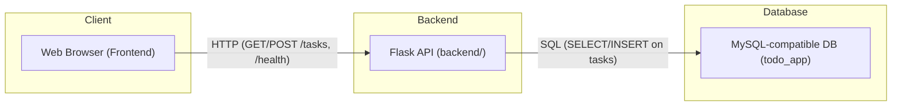
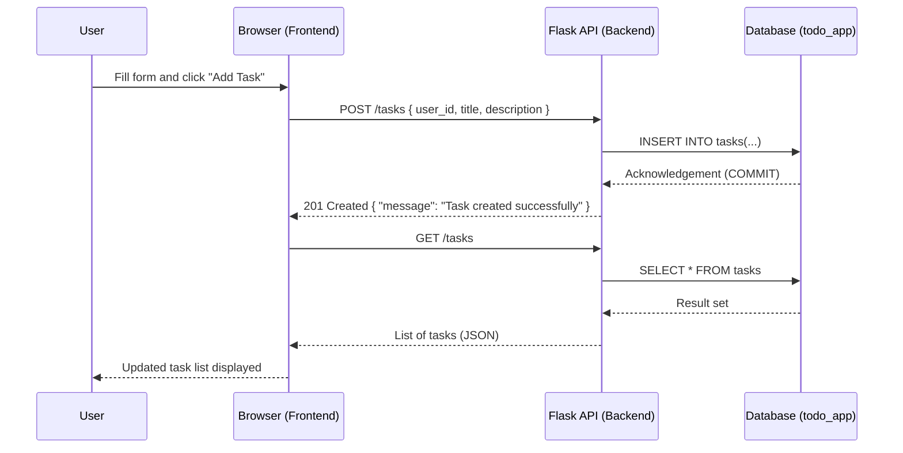

# To-Do Demo Application

This repository contains a **simple To-Do application** composed of:

- A **backend**: Flask API (`backend/`)
- A **frontend**: static web UI (`frontend/`)
- A **database schema**: MySQL-compatible SQL script (`database.sql`)

The application is intentionally small and straightforward. Its primary purpose is to serve as a **demo app** that will be reused across multiple DevOps and platform engineering projects (containerization, OpenShift deployments, CI/CD pipelines, monitoring, etc.).

Those DevOps-focused projects will live in **separate repositories** and reference this application as the demo workload.

---

## Repository Structure:

```text
.
├── backend/        # Flask API service
├── frontend/       # Static HTML/CSS/JS frontend
└── database.sql    # Database schema and seed data (MySQL-compatible)
```

---

## High-Level Overview :

- **Frontend (`frontend/`)**:
  - HTML/CSS/JS application.
  - Displays a list of tasks and a form to create new tasks.
  - Communicates with the backend via HTTP using the Fetch API.

- **Backend (`backend/`)**:
  - Flask API exposing:
    - `GET /health` – health check.
    - `GET /tasks` – list all tasks.
    - `POST /tasks` – create a new task.
  - Connects to a MySQL-compatible database using PyMySQL.
  - Uses environment variables for database configuration.

- **Database (`database.sql`)**:
  - Defines the `todo_app` database.
  - Creates two tables: `users` and `tasks`.
  - Configures foreign keys and simple indexes.
  - Inserts sample users and tasks.

---

## Diagrams:

### 1. Logical Architecture:



### 2. Request Flow : "Create Task":



---

## Database Schema:

The database is created and populated by `database.sql`.

### Schema Summary:

- **Database**: `todo_app`
- **Tables**:
  - `users`
  - `tasks`

### `users` Table:

```sql
CREATE TABLE IF NOT EXISTS users (
  id INT AUTO_INCREMENT PRIMARY KEY,
  username VARCHAR(50) NOT NULL UNIQUE,
  email VARCHAR(100) NOT NULL UNIQUE,
  password_hash VARCHAR(255) NOT NULL,
  created_at DATETIME DEFAULT CURRENT_TIMESTAMP
) ENGINE=InnoDB;
```

### `tasks` Table:

```sql
CREATE TABLE IF NOT EXISTS tasks (
  id INT AUTO_INCREMENT PRIMARY KEY,
  user_id INT NOT NULL,
  title VARCHAR(100) NOT NULL,
  description TEXT,
  status ENUM('pending', 'done') DEFAULT 'pending',
  created_at DATETIME DEFAULT CURRENT_TIMESTAMP,
  FOREIGN KEY (user_id) REFERENCES users(id) ON DELETE CASCADE,
  INDEX idx_user_id (user_id),
  INDEX idx_status (status)
) ENGINE=InnoDB;
```

### Sample Data:

```sql
INSERT INTO users (username, email, password_hash) VALUES
('alice', 'alice@mail.com', 'hashed_password'),
('bob', 'bob@mail.com', 'hashed_password');

INSERT INTO tasks (user_id, title, description, status) VALUES
(1, 'Buy milk', 'Go to supermarket to buy milk', 'pending'),
(2, 'Finish report', 'Complete project report', 'done');
```

---

## Running the Application Locally:

### 1. Database:

1. Start a MySQL-compatible database (e.g., MySQL) listening on:

   - Host: `localhost`
   - Port: `3306`

2. Create the schema and seed data:

   ```bash
   mysql -u root -p < database.sql
   ```

   Adjust user and connection options as needed.

---

### 2. Backend:

From the `backend` directory:

1. (Optional) Create and activate a virtual environment:

   ```bash
   python -m venv venv
   source venv/bin/activate      # Linux/macOS
   # venv\Scripts\activate       # Windows
   ```

2. Install dependencies:

   ```bash
   pip install -r requirements.txt
   ```

3. Set environment variables if needed (otherwise defaults will be used):

   ```bash
   export DB_HOST=localhost
   export DB_USER=root
   export DB_PASSWORD=password
   export DB_NAME=todo_app
   export DB_PORT=3306
   ```

4. Run the backend:

   ```bash
   python app.py
   ```

The backend will listen on `http://0.0.0.0:5000`.

---

### 3. Frontend:

From the `frontend` directory:

1. Ensure the backend is running at `http://localhost:5000`.
2. Open `index.html` in your browser
The frontend will call the backend using:

```javascript
const API_URL = "http://localhost:5000";
```

